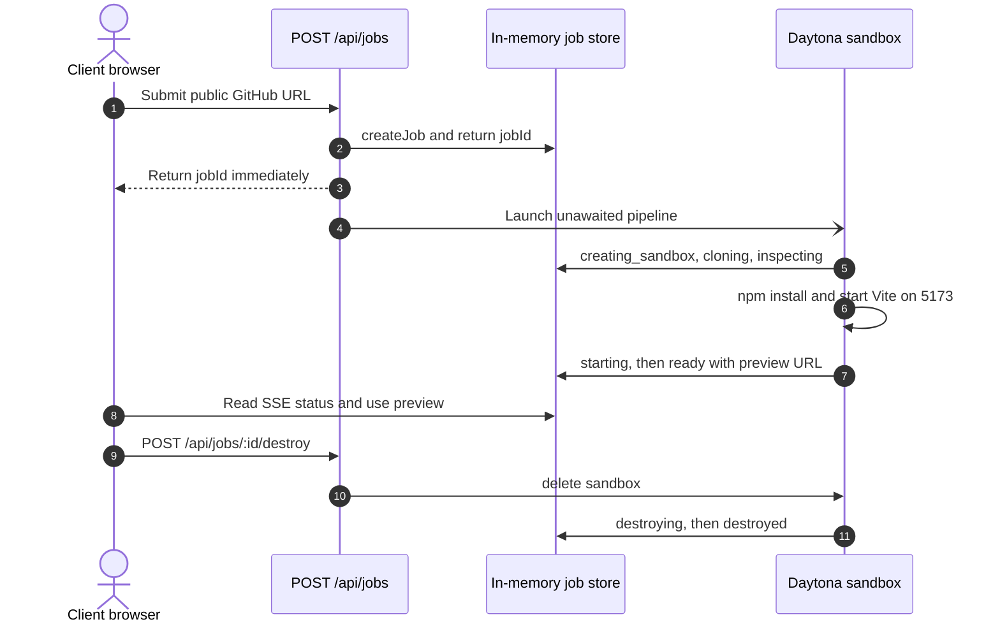

<!-- BEGIN:nextjs-agent-rules -->

# This is NOT the Next.js you know

This version has breaking changes — APIs, conventions, and file structure may all differ from your training data. Read the relevant guide in `node_modules/next/dist/docs/` (resolved from this file's directory; in monorepos the `next` package may not be visible from the repo root) before writing any code. Heed deprecation notices.

This block is written and re-added by `next dev` — verify at `node_modules/next/dist/server/lib/generate-agent-files.js`. Removing it from a diff only re-creates the uncommitted change; committing it with your work keeps the tree clean.

<!-- END:nextjs-agent-rules -->

# AGENTS.md

## What this project is

**Try SDK** turns a compatible public GitHub frontend repository into a temporary, shareable live preview. It is a disposable evaluation environment, not a deployment platform. The reliable launch recipes are public Vite and Astro applications, plus dependency-free static HTML sites, all served on port `5173`.

The product endpoint is a usable preview. AI analysis, Playwright screenshots, repository discovery, and parallel launches are explicitly deferred enhancements.

## Pipeline mental model

The POST route returns `{ jobId }` before sandbox work completes. `ready` means the preview is live; it does not trigger a required evaluation phase.

## Key files and responsibilities

| File | Purpose |
|---|---|
| `lib/types.ts` | Single source of truth for jobs, status events, and launch metadata |
| `lib/jobs.ts` | In-memory job store and parallel status-event map |
| `lib/sandbox.ts` | Thin wrappers around all `@daytona/sdk` calls |
| `lib/detector.ts` | Pure Vite/npm compatibility detection and launch recipe selection |
| `app/api/jobs/route.ts` | Creates a job and starts the background launcher |
| `app/api/jobs/[jobId]/stream/route.ts` | SSE status endpoint |
| `app/api/jobs/[jobId]/destroy/route.ts` | Explicit sandbox cleanup endpoint |
| `app/results/[jobId]/page.tsx` | Client result page with progress, preview, metadata, and destroy action |

## Conventions

### TypeScript

- Strict mode throughout — no `any` and no implicit returns.
- All shared types belong in `lib/types.ts`; do not redeclare them locally.

### Daytona calls

- Install `@daytona/sdk`, but only call it through `lib/sandbox.ts`; API routes never import the SDK directly.
- Clone through `sandbox.git.clone(githubUrl, 'workspace/repo')`, never a shell `git clone`.
- Start the application in a named session and bind it to `0.0.0.0`.
- Use `sandbox.getPreviewLink(5173)` for the supported recipe. Its returned token belongs only in preview requests requiring it.
- Keep successful sandboxes alive until the configured expiry or explicit destroy. Failed and unsupported jobs should attempt cleanup.

### Launch scope

- Accept only public HTTPS GitHub repository URLs.
- Support Vite and Astro projects with a usable `dev` or `start` script, plus dependency-free repositories with a root `index.html`. Reject all other stacks clearly.
- Use `npm ci` first, with a bounded `npm install` fallback.
- Do not accept secrets, databases, Docker, private packages, or arbitrary host ports.
- Every meaningful stage calls `emitStatus(jobId, status, message)` with plain-language user-facing text.

### Statuses and UI

Use these statuses: `queued`, `creating_sandbox`, `cloning`, `inspecting`, `installing`, `starting`, `ready`, `unsupported`, `failed`, `destroying`, and `destroyed`.

The result page should make the preview available at `ready` and show the repository, commit SHA, framework, package manager, sandbox ID, port, expiry, logs, copy-link/open controls, and destroy control. Unsupported and failed jobs need concise explanations, never an indefinite spinner.

## What to avoid

- Do not add a database, auth, queue, WebSockets, or a separate backend for the demo.
- Do not await the launch pipeline in the POST handler.
- Do not use `runtime = 'edge'` for the SSE route.
- Do not automatically delete a ready sandbox in the launch pipeline’s `finally` block.
- Do not add Playwright, Claude reports, agent repair, natural-language search, or parallel repository launches until URL → preview is reliable.
