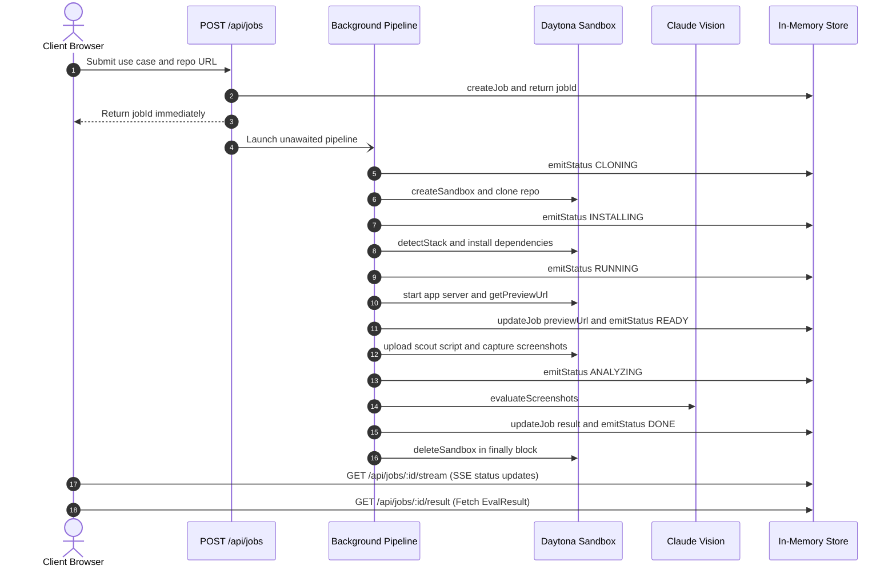

<!-- BEGIN:nextjs-agent-rules -->

# This is NOT the Next.js you know

This version has breaking changes — APIs, conventions, and file structure may all differ from your training data. Read the relevant guide in `node_modules/next/dist/docs/` (resolved from this file's directory; in monorepos the `next` package may not be visible from the repo root) before writing any code. Heed deprecation notices.

This block is written and re-added by `next dev` — verify at `node_modules/next/dist/server/lib/generate-agent-files.js`. Removing it from a diff only re-creates the uncommitted change; committing it with your work keeps the tree clean.

<!-- END:nextjs-agent-rules -->

# AGENTS.md

Guidance for AI coding agents (Claude Code, Cursor, Copilot, etc.) working in this repository.

## What this project is

**trysdk** is a Next.js 16 app that lets users evaluate whether an open-source GitHub repo fits their use case. It orchestrates a Daytona sandbox, runs Playwright inside it to screenshot the app, then uses Claude vision to produce a structured fit report.

## Pipeline mental model

Every job flows through exactly this sequence:



The route handler returns `{ jobId }` **before** the pipeline completes. The browser then streams status from the SSE endpoint.

## Key files and their responsibilities

| File | Purpose |
|---|---|
| `lib/types.ts` | Single source of truth for all types — edit here first |
| `lib/jobs.ts` | In-memory store; `emitStatus()` appends to a parallel `Map<string, StatusEvent[]>` |
| `lib/sandbox.ts` | Thin wrappers around `@daytona/sdk`; all Daytona calls go through here |
| `lib/detector.ts` | Pure function — `detectStack(fileList)` returns `{ installCmd, startCmd, port, language }` |
| `lib/evaluator.ts` | Claude vision integration; currently stubbed with TODO mock data |
| `scripts/scout.playwright.ts` | Uploaded to + run **inside** the sandbox — not a Next.js file |
| `app/api/jobs/route.ts` | Creates job + fires off background pipeline |
| `app/api/jobs/[jobId]/stream/route.ts` | SSE endpoint; `maxDuration = 300` for Vercel Pro |
| `app/results/[jobId]/page.tsx` | Client page: connects SSE, shows StatusFeed, then FitReport |

## Conventions

### TypeScript
- Strict mode throughout — no `any`, no implicit returns
- All shared types live in `lib/types.ts`; import from there, never redeclare locally

### Daytona calls
- npm package is `@daytona/sdk` — install with `npm install @daytona/sdk`
- Every call to `@daytona/sdk` must go through `lib/sandbox.ts` helpers; never import the SDK directly in route files
- `sandbox.process.executeCommand(cmd)` returns `{ result: string }` — not stdout/stderr/exitCode
- For background processes (starting the app server), use named sessions:
  ```ts
  await sandbox.process.createSession('server')
  await sandbox.process.executeSessionCommand('server', { command: startCmd, runAsync: true })
  ```
- Git clone uses the native SDK method: `await sandbox.git.clone(githubUrl, 'workspace/repo')` — do not use `execCommand("git clone ...")`
- `await sandbox.getPreviewLink(port)` returns `{ url, token }` — the token must be sent as the `x-daytona-preview-token` header when making requests to the preview URL
- `await sandbox.fs.uploadFile(Buffer.from(content), remotePath)` for uploading the scout script
- `await sandbox.fs.downloadFile(remotePath)` returns a `Buffer`
- `deleteSandbox()` must always be called in a `finally` block in the pipeline

### Status events
- Call `emitStatus(jobId, status, message)` before each meaningful pipeline step
- The `message` string is displayed directly to the user — write it in plain English

### AI Gateway (evaluator)
- `lib/evaluator.ts` uses the Vercel AI SDK (`ai` package) — **not** `@anthropic-ai/sdk`
- Model slug: `anthropic/claude-sonnet-4.6` (dots, not dashes — AI Gateway format)
- Vision calls use `generateText` with multimodal message content:
  ```ts
  import { generateText } from 'ai'
  await generateText({
    model: 'anthropic/claude-sonnet-4.6',
    messages: [{ role: 'user', content: [
      { type: 'image', image: Buffer.from(base64, 'base64'), mimeType: 'image/png' },
      { type: 'text', text: prompt }
    ]}]
  })
  ```
- Auth is OIDC via `VERCEL_OIDC_TOKEN` — no `ANTHROPIC_API_KEY` needed
- Local dev: run `vercel env pull .env.local` to get a fresh token (~24h validity)

### Evaluator stubs
- `lib/evaluator.ts` is currently stubbed — mark any placeholder with `// TODO:`
- Do not remove the TODO markers until real AI Gateway calls are wired up

### Scout script
- `scripts/scout.playwright.ts` runs inside a Daytona sandbox, not in Node locally
- It reads `APP_URL` and `OUTPUT_DIR` from env vars
- It saves `routes.json` + `<route-slug>.png` files to `OUTPUT_DIR`

### SSE stream route
- Polls `StatusEvent[]` every 500ms
- Closes when status is `DONE` or `ERROR`
- Each event: `data: ${JSON.stringify(event)}\n\n`

## Environment variables

```
VERCEL_OIDC_TOKEN=       # auto-provisioned by: vercel env pull .env.local (AI Gateway auth)
DAYTONA_API_KEY=         # required for sandbox.ts
DAYTONA_API_URL=         # optional; defaults to https://app.daytona.io/api
NEXT_PUBLIC_APP_URL=     # used for absolute URLs in client components
```

## What is stubbed / TODO

1. `lib/evaluator.ts` — real Claude vision calls; currently returns mock `EvalResult`
2. `scripts/scout.playwright.ts` execution in sandbox — the `execCommand` call for running the scout script is stubbed with a TODO
3. Stack detection for non-JS/Python repos — `detector.ts` throws a descriptive error for unknown stacks

## What to avoid

- Do not add a database — in-memory Map is intentional for this demo scope
- Do not add auth
- Do not await the background pipeline in the POST route handler — it must fire and return `jobId` immediately
- Do not use `runtime = 'edge'` — the SSE route needs Node.js for the polling loop and `maxDuration = 300`
- Do not call Daytona SDK directly in API routes — always go through `lib/sandbox.ts`

