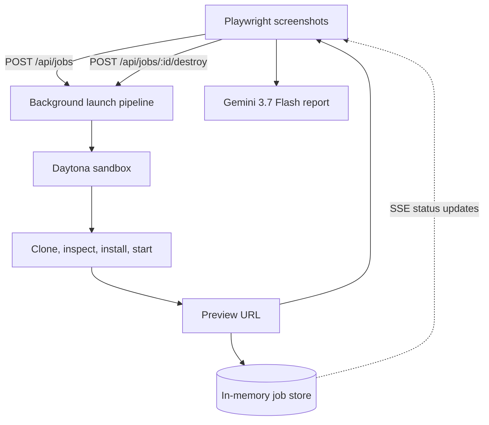

# Try SDK

> Paste a compatible public GitHub frontend repository and open a temporary, shareable live preview—without setting it up locally.

**Live Application:** [https://trysdk-gamma.vercel.app/](https://trysdk-gamma.vercel.app/)

**Video Presentation** [https://www.loom.com/share/ee1c066b6f584aeeb9430900a622371b](https://www.loom.com/share/ee1c066b6f584aeeb9430900a622371b)

Try SDK is a disposable evaluation environment, not a deployment platform. It starts with public, npm-based Vite repositories and clearly explains when a repository is not supported.

## What it does

1. Paste a public GitHub repository URL.
2. Try SDK creates an isolated Daytona sandbox and clones the repository.
3. It inspects the project, installs dependencies, and starts the app on a known preview port.
4. Playwright explores the running app, follows same-origin links, and captures up to six screenshots.
5. Gemini 3.7 Flash compares that evidence against the goal you supplied and returns a fit report.
6. Open or share the live preview, then explicitly destroy the sandbox when finished.

The result page shows launch progress, the repository and commit, detected framework and package manager, sandbox ID, remaining lifetime, logs, and an unsupported or failed state where appropriate.

## Scope today

- Public HTTPS GitHub repositories only
- Node.js frontend applications; Vite first
- `package.json` with a usable `dev` or `start` script
- npm and one known preview port (`5173`)
- No private packages, databases, Docker daemon, required secrets, or arbitrary host ports

The UI should say **“Works best with Vite frontend repositories.”** It must not imply that every GitHub project can be launched.

## Tech stack

| Layer | Choice |
|---|---|
| Framework | Next.js 16 App Router, TypeScript strict |
| UI | Tailwind CSS + shadcn/ui |
| Sandbox | Daytona TypeScript SDK (`@daytona/sdk`) |
| Deployment | Vercel ([trysdk-gamma.vercel.app](https://trysdk-gamma.vercel.app/)) |
| State | In-memory `Map` — no database |
| Updates | SSE status stream |

## Getting started

### Prerequisites

- Node.js 20+
- Daytona account and API key
- Vercel AI Gateway API key (for Gemini evaluation)

### Install and run

```bash
npm install
# add DAYTONA_API_KEY and AI_GATEWAY_API_KEY to .env.local
npm run dev
```

Open [http://localhost:3000](http://localhost:3000).

### Environment variables

| Variable | Description |
|---|---|
| `DAYTONA_API_KEY` | Required Daytona API key |
| `DAYTONA_API_URL` | Optional; defaults to `https://app.daytona.io/api` |
| `AI_GATEWAY_API_KEY` | Required to run Gemini 3.7 Flash through Vercel AI Gateway |
| `NEXT_PUBLIC_APP_URL` | Public control-app URL; defaults to `http://localhost:3000` |

## User journey

1. Describe the goal you want the project to satisfy, then paste a public Vite repository URL.
2. Click **Try it** and follow the live stages through launch, browser inspection, and Gemini evaluation.
3. Use the live preview while the assessment runs.
4. Inspect the evidence-backed fit score, visible features, gaps, caveats, and screenshots.
5. Click **Destroy sandbox** when the evaluation is finished.

## Architecture overview



See [docs/architecture.md](docs/architecture.md) for the API and lifecycle, and [docs/build-plan.md](docs/build-plan.md) for the implementation order.

## Product direction

Today, Try SDK turns one GitHub repository into a live experience and assesses its visible product fit against a user-defined goal. Later, it can search GitHub and launch compatible candidates in parallel so users can evaluate software by using it, not by reading README files.

## Limitations and cleanup

- Jobs are in memory and disappear on control-app restart.
- Sandboxes are temporary and receive no host credentials.
- Ready sandboxes remain available for their configured lifetime or until the user destroys them.
- Failed or unsupported jobs attempt cleanup automatically.
