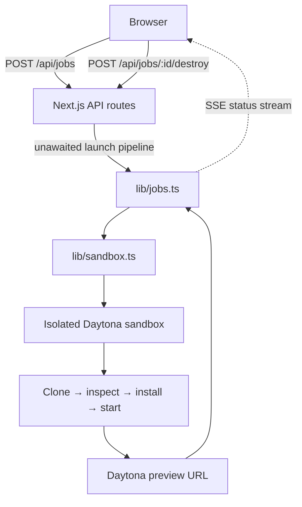
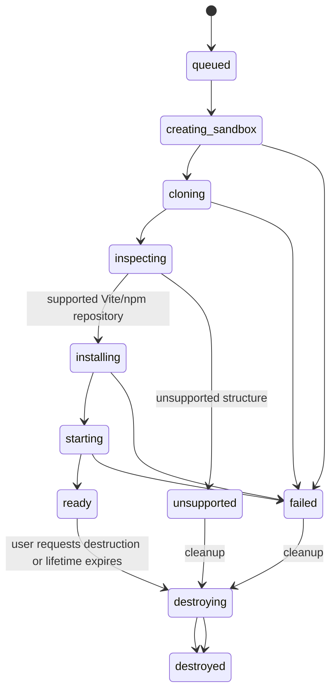
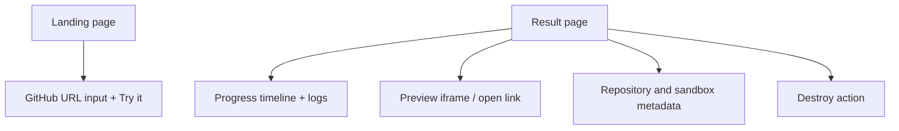

# Architecture

## System overview

Try SDK remains a single Next.js 16 App Router application. API routes own orchestration, `lib/jobs.ts` retains temporary state in memory, and all remote execution goes through thin Daytona wrappers in `lib/sandbox.ts`. No database, auth, queue, or separate backend is required for the demo.



## API contract

```text
POST /api/jobs
{ "repoUrl": "https://github.com/owner/repository" }

202 { "jobId": "abc123" }

GET /api/jobs/:jobId
GET /api/jobs/:jobId/stream
POST /api/jobs/:jobId/destroy
```

The POST handler validates that `repoUrl` is a public HTTPS GitHub URL, creates a job, starts an unawaited pipeline, and immediately returns the ID. The client subscribes through SSE and reads the job for its preview URL and metadata. This preserves the original asynchronous architecture while making `ready` the successful product outcome.

## Job lifecycle



`ready` is not followed by evaluation. It means the application is available to use. The job keeps its sandbox ID, port, preview URL, commit SHA, detected framework, package manager, logs, and expiry time until destruction or control-app restart.

## Launch pipeline

The initial supported recipe is intentionally deterministic:

1. Validate the GitHub URL and create an isolated sandbox.
2. Clone to a fixed workspace using `sandbox.git.clone()`.
3. Read `package.json`, lockfiles, and commit SHA.
4. Accept Vite projects with a usable `dev` or `start` script; otherwise emit `unsupported` with an explanation.
5. Run `npm ci`; only fall back to `npm install` if the lockfile path cannot be used.
6. Start `npm run dev -- --host 0.0.0.0 --port 5173` through a named session.
7. Wait for readiness with a bounded timeout and obtain `sandbox.getPreviewLink(5173)`.
8. Store the preview and metadata, emit `ready`, and keep the sandbox alive until expiry or explicit destruction.

Each meaningful stage calls `emitStatus(jobId, status, message)`. Status messages are user-facing and are streamed by `GET /api/jobs/:jobId/stream` as SSE.

## Sandbox boundary and cleanup

The sandbox runs untrusted public repository code in its own filesystem and process environment. It receives no host credentials. Only the known preview port is exposed.

Failed and unsupported jobs attempt deletion immediately. Ready jobs are not deleted in the launch pipeline’s `finally` block: that would invalidate the product’s preview and sharing promise. Instead, `POST /api/jobs/:id/destroy` performs deletion, and a configured Daytona lifecycle limit covers abandoned sandboxes.

## Components



The result page is a client component that opens the existing SSE stream, renders state changes, and enables preview actions once `ready` arrives. It renders concise unsupported and failed states for non-launchable repositories.

## Deliberately deferred extensions

The former screenshot, Playwright, and Claude-evaluation path is a possible later extension after a preview is ready. It is not on the critical path and must never prevent a user from opening a working preview. Future discovery can create multiple instances of this same launch pipeline for search-selected repositories.
