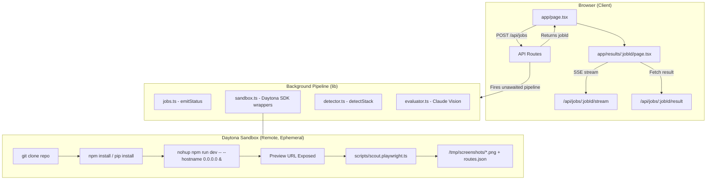
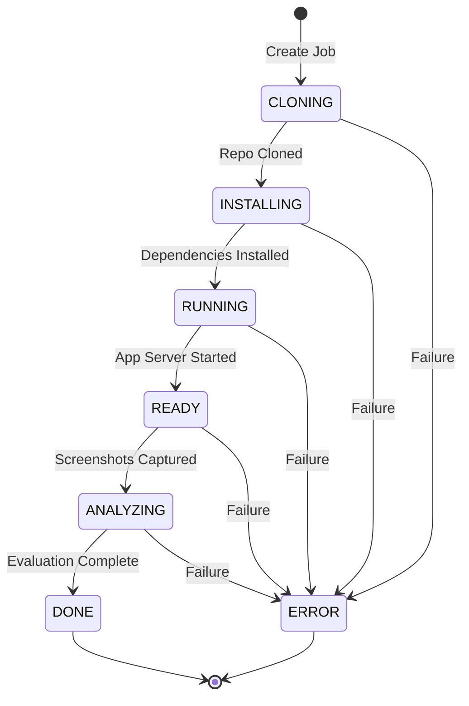
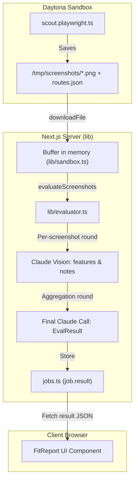
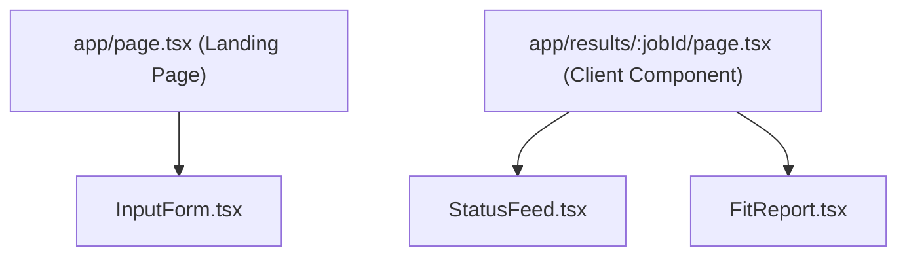

# Architecture

## System overview

trysdk is a single Next.js 16 App Router application with no external backend, no database, and no auth. All orchestration happens in API routes via the Daytona TypeScript SDK.



## Job lifecycle

Each job has an ID (UUID), stored in two in-memory maps in `lib/jobs.ts`:

```
jobs: Map<string, Job>
events: Map<string, StatusEvent[]>
```

**Job status progression:**



The pipeline runs as an unawaited async IIFE inside `POST /api/jobs`. The route returns `{ jobId }` before any sandbox work begins.

## Data flow: screenshots to report



## SSE streaming

The `GET /api/jobs/[jobId]/stream` route returns a `ReadableStream` with `Content-Type: text/event-stream`. It polls `events` every 500 ms and pipes new `StatusEvent` objects:

```
data: {"status":"CLONING","message":"Cloning repository...","timestamp":"..."}\n\n
data: {"status":"INSTALLING","message":"Detecting stack...","timestamp":"..."}\n\n
...
data: {"status":"DONE","message":"Evaluation complete","timestamp":"..."}\n\n
[stream closes]
```

The client (`app/results/[jobId]/page.tsx`) reads via `EventSource`. Once `DONE` arrives it closes the source and fetches the result from `/api/jobs/[jobId]/result`.

`maxDuration = 300` is set on the stream route (Vercel Pro) to support long-running repos.

## Stack detection

`lib/detector.ts` receives a flat string array of file paths from the sandbox and returns `{ installCmd, startCmd, port, language }`. Detection priority:

1. `package.json` + "next" dependency → Next.js (port 3000)
2. `package.json` + "vite" dependency → Vite (port 5173)
3. `package.json` (generic) → Node (port 3000)
4. `requirements.txt` containing "streamlit" → Streamlit (port 8501)
5. `requirements.txt` containing "fastapi" or "uvicorn" → FastAPI (port 8000)
6. `requirements.txt` (generic) → Flask (port 5000)
7. Unknown → throws a descriptive error

The `startCmd` always includes `0.0.0.0` binding so Daytona can expose the port.

## Evaluator (Claude vision via Vercel AI Gateway)

`lib/evaluator.ts` uses the Vercel AI SDK (`ai` package) routed through the **Vercel AI Gateway** — not `@anthropic-ai/sdk` directly. This gives observability, failover, and OIDC auth with no per-key management.

Model slug: `anthropic/claude-sonnet-4.6` (dots, not dashes).

Two rounds of calls:

1. **Per-screenshot round**: sends each `Screenshot.base64` as an image content part alongside the use case and route name. Expects structured JSON back: `{ features: Feature[], notes: string }`.
   ```ts
   import { generateText } from 'ai'
   await generateText({
     model: 'anthropic/claude-sonnet-4.6',
     messages: [{ role: 'user', content: [
       { type: 'image', image: Buffer.from(base64, 'base64'), mimeType: 'image/png' },
       { type: 'text', text: prompt }
     ]}]
   })
   ```
2. **Aggregation round**: sends all per-screenshot notes as text to produce the final `EvalResult` (`fitScore` 0–10, `summary`, `verdict`, `caveats`).

Auth: `VERCEL_OIDC_TOKEN` (auto-provisioned by `vercel env pull .env.local`; auto-refreshed on Vercel). Currently stubbed with mock data marked `// TODO:`.

## Sandbox wrapper design

`lib/sandbox.ts` exposes named async functions — no class. This keeps call sites simple and makes the Daytona SDK mockable at the module level in tests. Each function wraps the SDK method in try/catch and re-throws with a human-readable message.

**npm package**: `@daytona/sdk` (import: `import { Daytona } from '@daytona/sdk'`)

Key functions and the underlying SDK calls they wrap:

| Wrapper | SDK call | Notes |
|---|---|---|
| `createSandbox(jobId)` | `daytona.create()` | Default network allows outbound; pass `networkBlockAll: true` only to lock down |
| `execCommand(sandbox, cmd)` | `sandbox.process.executeCommand(cmd)` | Returns `{ result: string }` — not stdout/stderr/exitCode |
| `startBackground(sandbox, name, cmd)` | `createSession` + `executeSessionCommand({ runAsync: true })` | For starting the app server that stays alive |
| `cloneRepo(sandbox, url)` | `sandbox.git.clone(url, 'workspace/repo')` | Native SDK — do not shell out `git clone` |
| `uploadFile(sandbox, content, remotePath)` | `sandbox.fs.uploadFile(Buffer.from(content), remotePath)` | Used to push `scout.playwright.ts` |
| `downloadFile(sandbox, remotePath)` | `sandbox.fs.downloadFile(remotePath)` | Returns `Buffer` |
| `getPreviewUrl(sandbox, port)` | `sandbox.getPreviewLink(port)` | Returns `{ url, token }` — token sent as `x-daytona-preview-token` header |
| `deleteSandbox(sandbox)` | `sandbox.delete()` | Always called in `finally` |

## Frontend components



`FitReport` receives an `EvalResult` prop — no internal data fetching. The parent page handles the fetch after the SSE stream closes.

## Deployment

Deployed to Vercel with no extra configuration. The in-memory store means **jobs do not survive restarts** and are not shared across function instances — acceptable for a hackathon/demo context. For production multi-instance use, the job store would need to move to Redis or a database.
