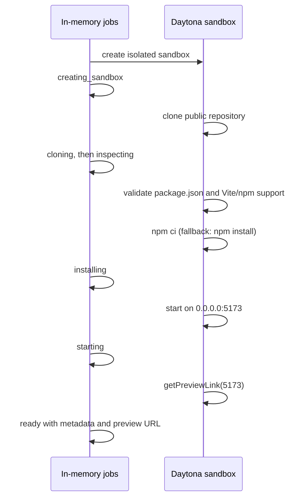

# Build plan

Build a reliable URL-to-preview path before adding capability. Each phase produces something demonstrable and keeps the existing Next.js API-route, SSE, in-memory-job, and Daytona-wrapper architecture.

## Phase 1 — Contract and scaffold

Create the app shell and define the stable launch contract in `lib/types.ts`.

```ts
type JobStatus =
  | 'queued'
  | 'creating_sandbox'
  | 'cloning'
  | 'inspecting'
  | 'installing'
  | 'starting'
  | 'ready'
  | 'unsupported'
  | 'failed'
  | 'destroying'
  | 'destroyed'

type Job = {
  id: string
  repoUrl: string
  status: JobStatus
  framework: 'vite' | null
  packageManager: 'npm' | null
  sandboxId: string | null
  commitSha: string | null
  port: number | null
  previewUrl: string | null
  logs: string[]
  error: string | null
  createdAt: string
  readyAt: string | null
  expiresAt: string | null
}
```

Retain `lib/jobs.ts` as the in-memory job store and status-event source. The landing page has one GitHub URL field and a **Try it** button; no use-case field is required.

**Checkpoint:** `npm run build` passes and the mocked UI renders queued, ready, unsupported, failed, and destroyed jobs.

## Phase 2 — Prove the Daytona happy path

Before building route abstractions, write a standalone TypeScript script that creates a sandbox, clones one rehearsed public Vite repository, runs it, and prints a Daytona preview URL. Run it successfully from a cold sandbox three times.

Use only `lib/sandbox.ts` wrappers in the app:

- create a sandbox with a lifecycle suitable for the demo;
- clone through `sandbox.git.clone()`;
- read `package.json` and the commit SHA;
- run `npm ci`, falling back to `npm install` only when necessary;
- start with `npm run dev -- --host 0.0.0.0 --port 5173` in a named background session;
- request `sandbox.getPreviewLink(5173)`.

**Checkpoint:** a known Vite repository opens at a working preview URL.

## Phase 3 — Launch API and pipeline

Keep the existing API shape and fire the pipeline without awaiting it.

```text
POST /api/jobs
{ "repoUrl": "https://github.com/owner/repository" }

202 { "jobId": "abc123" }

GET /api/jobs/:jobId
GET /api/jobs/:jobId/stream
POST /api/jobs/:jobId/destroy
```

The launch pipeline is deliberately narrow:



Validate an HTTPS GitHub URL before allocating a sandbox. Unsupported repositories must transition to `unsupported` with a concise reason. Bound clone, install, readiness, and overall launch timeouts; a failure becomes `failed`, preserves a useful log excerpt, and attempts cleanup.

**Checkpoint:** `POST /api/jobs` launches a supported repository end to end, while unsupported input returns a clear status rather than spinning indefinitely.

## Phase 4 — Preview-first result surface

Retain the SSE status feed, but make `ready` the primary successful endpoint. The result page must show:

- current launch stage, elapsed time, and expandable concise logs;
- running preview in an iframe or a clear open-preview action;
- open-in-new-tab and copy-share-link controls;
- repository URL, commit SHA, framework, package manager, sandbox ID, port, and expiry;
- explicit **Destroy sandbox** action and visible `destroying` → `destroyed` transition;
- dedicated unsupported and failed views.

**Checkpoint:** a user can launch, use, share, and destroy the preview without any AI or browser-automation step.

## Phase 5 — Reliability and demo

- Confirm the primary and backup Vite repositories launch from cold sandboxes three times each.
- Record timing for sandbox creation, install, startup, and overall launch.
- Test destroy and automatic cleanup after failed jobs.
- Deploy the control application and rehearse the three-minute story.
- Record one successful end-to-end fallback demo.

## Selected demo repositories

### Primary — Procedural Planets

Use [dgreenheck/threejs-procedural-planets](https://github.com/dgreenheck/threejs-procedural-planets).

Why it is the primary:

- It is a visually striking interactive Three.js planet with atmosphere, bloom, procedural terrain, biome colouring, and live controls.
- Its manifest contains only `three` and `vite`, with a `package-lock.json` suitable for `npm ci`.
- Its `dev` script is plain `vite`.
- It has no required API key, database, authentication, backend, or large asset payload.
- It is MIT licensed.

Verified files:

- [package.json](https://github.com/dgreenheck/threejs-procedural-planets/blob/main/package.json)
- [Vite configuration](https://github.com/dgreenheck/threejs-procedural-planets/blob/main/vite.config.js)
- [interactive controls](https://github.com/dgreenheck/threejs-procedural-planets/blob/main/scripts/ui.js)
- [license](https://github.com/dgreenheck/threejs-procedural-planets/blob/main/LICENSE)

Launch with:

```bash
npm ci
npx vite --host 0.0.0.0 --port 5173 --base /
```

On-stage interaction:

1. Drag the planet to orbit it.
2. Open **Terrain** and switch the type from `simplex` to `ridgedFractal`.
3. Increase **Amplitude** so the terrain visibly reforms.
4. If time permits, adjust the atmosphere thickness or a biome colour.

Do not spend more than 25–30 seconds interacting with the app. One obvious real-time transformation is enough to prove that the preview is live.

### Backup 1 — SQL to ER Diagram

Use [royalbhati/sqltoerdiagram](https://github.com/royalbhati/sqltoerdiagram).

This is the reliability-first backup. It is a small MIT-licensed Vite app, works locally without a backend, and turns SQL into an interactive ER diagram. Paste a prepared `CREATE TABLE` example, then drag or highlight a table to demonstrate the live app.

```bash
npm ci
npx vite --host 0.0.0.0 --port 5173 --base /
```

### Backup 2 — Sakura Realm

Use [Leonxlnx/sakura-realm](https://github.com/Leonxlnx/sakura-realm).

This is the visual-impact backup: an interactive Three.js landscape with clouds, weather, day/night controls, movement, and procedural blossoms. It is heavier than the primary and its package script pins port `5174`, so invoke Vite directly with the required Try SDK port.

```bash
npm ci
npx vite --host 0.0.0.0 --port 5173 --base /
```

### Business demo — TailAdmin dashboard

Use [TailAdmin/free-react-tailwind-admin-dashboard](https://github.com/TailAdmin/free-react-tailwind-admin-dashboard) when a business-software story lands better than a visual one.

A polished MIT-licensed ecommerce admin dashboard (React 19, Tailwind v4): KPI cards, sales charts, a monthly-target gauge, calendar, tables, and dark mode on first paint. Plain `"dev": "vite"`, npm lockfile v3, no backend, environment variables, or base-path override. Verified locally: `npm ci` succeeds and the dev server binds `0.0.0.0:5173`.

**Caution:** cold `npm ci` took about 2 minutes 16 seconds (347 packages) — far slower than the planets repository (~8 seconds). Use it as a second launch while narrating, not the opener.

```bash
npm ci
npm run dev -- --host 0.0.0.0 --port 5173
```

On stage: point at the KPI cards and sales chart, toggle dark mode, open Calendar and drag-create an event.

### Business demo alternative — shadcn dashboard

Use [shadcndashboard/shadcndashboard](https://github.com/shadcndashboard/shadcndashboard) only if TailAdmin fails. MIT, plain `vite` dev script, verified locally on `0.0.0.0:5173` — but ~38 MB clone, cold `npm ci` took about 3 minutes 8 seconds (577 packages), and its Notes/Tickets pages rely on a mock service worker that requires a secure context, so demo only the dashboard view.

### Install speed

Measured on TailAdmin: cold `npm ci` took 2 m 16 s of wall time but only ~9 s of CPU — the wait is registry download, not computation. A warm npm cache reduced the same install to **15 s**. Two remedies, in order of value:

1. **Warm the npm cache in the sandbox image.** Build a Daytona snapshot that has already run `npm ci` once for the rehearsed demo repositories (the cache under `~/.npm` is what matters; `node_modules` can be discarded). Launches then install in seconds while remaining a genuine install.
2. **Trim npm overhead everywhere.** Use `npm ci --no-audit --no-fund --loglevel=error` in the pipeline install command — it skips the audit round trip and noise at zero risk.

Also time an untouched launch inside Daytona before assuming the local numbers apply: sandbox network throughput to the npm registry may be materially faster than the machine these baselines came from.

### Repository rehearsal rule

The final demo repository is the primary only after it has launched from a new Daytona sandbox three consecutive times through the complete Try SDK interface. If it does not pass that test, switch to Backup 1 rather than debugging visual code or dependencies close to submission.

## Deferred work

Do not add these until the core flow is reliable:

- pnpm, Yarn, Next.js, or non-Node launch recipes;
- private repositories, secrets, databases, Docker, arbitrary ports, and production hosting;
- persistent history, authentication, WebSockets, queues, or a database;
- Playwright screenshots, Claude fit reports, agent repair, and browser testing;
- natural-language GitHub discovery and parallel repository launches.

When the single-repository experience is stable, discovery can become the next product phase: rank compatible repositories and launch selected candidates in parallel. Validation reports may then use the evidence already stored on `Job` (commit, commands, durations, logs, preview URL, and lifecycle timestamps).

## Provisional final demo script

This script is intentionally provisional. Adjust the timing and wording after three cold-launch rehearsals with the selected demo repository. Target **2 minutes 30 seconds**, leaving 30 seconds of contingency.

### Before taking the stage

- Open Try SDK in a clean browser tab.
- Keep the selected repository's GitHub page open in a second tab.
- Copy the tested repository URL to the clipboard.
- Keep a previously launched preview open in a hidden fallback tab.
- Keep a short successful screen recording ready.
- Do not depend on live typing, GitHub search, audience participation, or a second repository.

### 0:00–0:20 — State the problem

**Screen:** Show the repository's GitHub page and README.

**Say:**

> “GitHub made source code one click away. But if I want to experience this project, I still have to clone it, install the right runtime and dependencies, discover the start command, and expose the correct port. That is a lot of setup just to answer one question: what does this actually feel like?”

### 0:20–0:35 — Introduce Try SDK

**Screen:** Switch to the Try SDK landing page.

**Say:**

> “Try SDK gives compatible GitHub frontend repositories a Try button. Paste the repository and we create a disposable environment where you can use the product immediately.”

Paste the prepared URL and click **Try it**.

### 0:35–1:15 — Make the launch visible

**Screen:** Show the real progress timeline, with detailed logs collapsed.

**Say:**

> “Try SDK creates an isolated Daytona sandbox, clones the repository, inspects the project, installs its dependencies, and starts the development server. Nothing is installed on my laptop, and the repository gets its own filesystem, process, and network environment.”

Briefly point out the detected framework, package manager, commit SHA, and Daytona sandbox ID as they appear.

If launch takes longer than expected, add:

> “We are not rendering a screenshot or rebuilding this as a mock. This is the repository's actual code running in its own environment.”

### 1:15–1:50 — Prove that it is real

**Screen:** Open the live preview.

**Say:**

> “And now this GitHub repository is a running application.”

Perform one obvious interaction that changes application state. Then show the share action or QR code if it is reliable.

**Say:**

> “The preview is shareable, so a teammate, recruiter, maintainer, or hackathon judge can experience the project without reproducing the setup.”

Do not wait for audience participation.

### 1:50–2:10 — Demonstrate the disposable model

**Screen:** Return to Try SDK and show the sandbox metadata.

**Say:**

> “This is an evaluation environment, not permanent hosting. When I am finished, I can destroy the sandbox and remove the running code and its dependencies.”

Click **Destroy sandbox** only if deletion has been tested and the UI responds immediately. Otherwise, point to the expiry information and explain that the environment is automatically cleaned up.

### 2:10–2:30 — Close and expand

**Screen:** Show the successful Try SDK result page.

**Say:**

> “Today, Try SDK turns one compatible GitHub frontend repository into a live experience. Next, it can search GitHub and launch the best candidates in parallel, so developers choose software by using it rather than reading about it. Every GitHub repository should have a Try button.”

Stop there. Do not introduce validation agents, compliance, or multiple-model generation unless asked.

### Fallback ladder

1. **Slow launch:** keep the progress view visible and explain that the actual repository is being installed and executed.
2. **Launch failure:** show the bounded failure state, then open the previously launched preview.
3. **Preview failure:** open the hidden fallback preview tab.
4. **Venue connectivity failure:** play the backup recording and narrate it live.
5. **Slow destruction:** show the expiry metadata and proceed to the close.

### Demo discipline

- Use one repository only.
- Use a repository that has launched successfully from a cold sandbox three consecutive times.
- Never claim support for every GitHub repository.
- Never choose a random repository on stage.
- Never edit code during the demonstration.
- Show one real interaction inside the preview.
- Finish with the same “Try button” statement used at the beginning.
