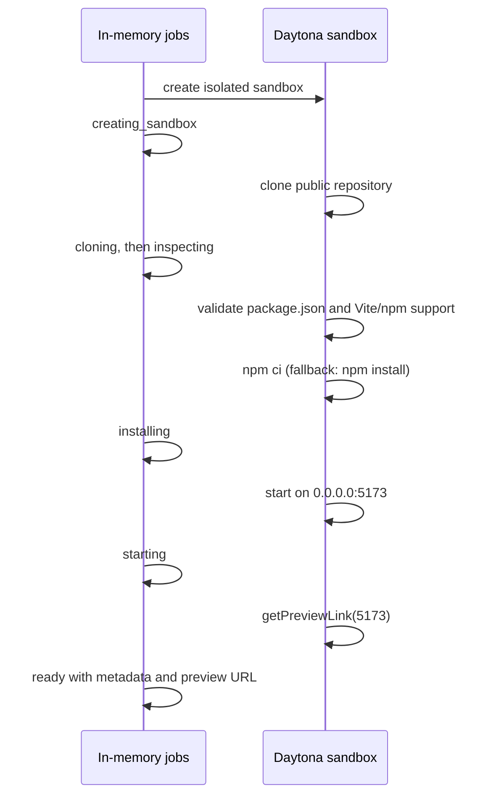

# Build plan

Build a reliable URL-to-preview path before adding capability. Each phase produces something demonstrable and keeps the existing Next.js API-route, SSE, in-memory-job, and Daytona-wrapper architecture.

## Phase 1 — Contract and scaffold

Create the app shell and define the stable launch contract in `lib/types.ts`.

```ts
type JobStatus =
  | 'queued'
  | 'creating_sandbox'
  | 'cloning'
  | 'inspecting'
  | 'installing'
  | 'starting'
  | 'ready'
  | 'unsupported'
  | 'failed'
  | 'destroying'
  | 'destroyed'

type Job = {
  id: string
  repoUrl: string
  status: JobStatus
  framework: 'vite' | null
  packageManager: 'npm' | null
  sandboxId: string | null
  commitSha: string | null
  port: number | null
  previewUrl: string | null
  logs: string[]
  error: string | null
  createdAt: string
  readyAt: string | null
  expiresAt: string | null
}
```

Retain `lib/jobs.ts` as the in-memory job store and status-event source. The landing page has one GitHub URL field and a **Try it** button; no use-case field is required.

**Checkpoint:** `npm run build` passes and the mocked UI renders queued, ready, unsupported, failed, and destroyed jobs.

## Phase 2 — Prove the Daytona happy path

Before building route abstractions, write a standalone TypeScript script that creates a sandbox, clones one rehearsed public Vite repository, runs it, and prints a Daytona preview URL. Run it successfully from a cold sandbox three times.

Use only `lib/sandbox.ts` wrappers in the app:

- create a sandbox with a lifecycle suitable for the demo;
- clone through `sandbox.git.clone()`;
- read `package.json` and the commit SHA;
- run `npm ci`, falling back to `npm install` only when necessary;
- start with `npm run dev -- --host 0.0.0.0 --port 5173` in a named background session;
- request `sandbox.getPreviewLink(5173)`.

**Checkpoint:** a known Vite repository opens at a working preview URL.

## Phase 3 — Launch API and pipeline

Keep the existing API shape and fire the pipeline without awaiting it.

```text
POST /api/jobs
{ "repoUrl": "https://github.com/owner/repository" }

202 { "jobId": "abc123" }

GET /api/jobs/:jobId
GET /api/jobs/:jobId/stream
POST /api/jobs/:jobId/destroy
```

The launch pipeline is deliberately narrow:



Validate an HTTPS GitHub URL before allocating a sandbox. Unsupported repositories must transition to `unsupported` with a concise reason. Bound clone, install, readiness, and overall launch timeouts; a failure becomes `failed`, preserves a useful log excerpt, and attempts cleanup.

**Checkpoint:** `POST /api/jobs` launches a supported repository end to end, while unsupported input returns a clear status rather than spinning indefinitely.

## Phase 4 — Preview-first result surface

Retain the SSE status feed, but make `ready` the primary successful endpoint. The result page must show:

- current launch stage, elapsed time, and expandable concise logs;
- running preview in an iframe or a clear open-preview action;
- open-in-new-tab and copy-share-link controls;
- repository URL, commit SHA, framework, package manager, sandbox ID, port, and expiry;
- explicit **Destroy sandbox** action and visible `destroying` → `destroyed` transition;
- dedicated unsupported and failed views.

**Checkpoint:** a user can launch, use, share, and destroy the preview without any AI or browser-automation step.

## Phase 5 — Reliability and demo

- Confirm the primary and backup Vite repositories launch from cold sandboxes three times each.
- Record timing for sandbox creation, install, startup, and overall launch.
- Test destroy and automatic cleanup after failed jobs.
- Deploy the control application and rehearse the three-minute story.
- Record one successful end-to-end fallback demo.

## Deferred work

Do not add these until the core flow is reliable:

- pnpm, Yarn, Next.js, or non-Node launch recipes;
- private repositories, secrets, databases, Docker, arbitrary ports, and production hosting;
- persistent history, authentication, WebSockets, queues, or a database;
- Playwright screenshots, Claude fit reports, agent repair, and browser testing;
- natural-language GitHub discovery and parallel repository launches.

When the single-repository experience is stable, discovery can become the next product phase: rank compatible repositories and launch selected candidates in parallel. Validation reports may then use the evidence already stored on `Job` (commit, commands, durations, logs, preview URL, and lifecycle timestamps).
